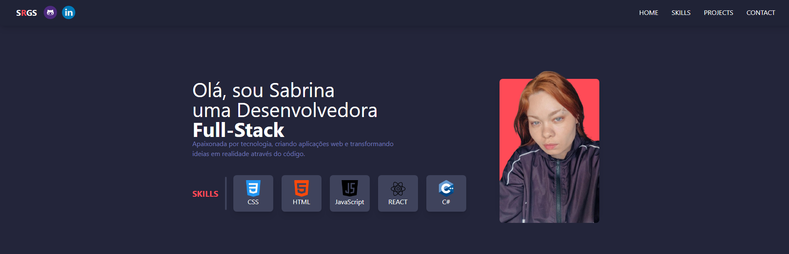

# 💻 Portfólio — Sabrina Ribeiro

Bem-vindo ao meu portfólio 💜
Este projeto foi criado para apresentar minhas habilidades, projetos e tecnologias que venho estudando na área de desenvolvimento de software.

---

## ✨ Sobre

Sou estudante de **Sistemas de Informação** e apaixonada por tecnologia e desenvolvimento web.
Gosto de transformar ideias em aplicações reais, funcionais e bem estruturadas.

Atualmente, estou focada no desenvolvimento web, criando interfaces modernas, responsivas e interativas.

---

## 🚀 Tecnologias utilizadas

* React
* JavaScript
* HTML5
* CSS3
* Tailwind CSS
* Node.js

---

## 🌐 Acesse o portfólio

👉 Em breve disponível online

---

## 📸 Preview



---

## 📂 Como executar o projeto localmente

```bash
# Clone o repositório
git clone https://github.com/Sabrinargs/Portifolio.git

# Acesse a pasta
cd Portifolio

# Instale as dependências
npm install

# Execute o projeto
npm run dev
```

---

## 📬 Contato

* 💼 LinkedIn: https://www.linkedin.com/in/sabrina-ribeiro-b11614246/
* 📧 Email: rsabrina508@gmail.com

---

⭐ Obrigada por visitar meu repositório!
